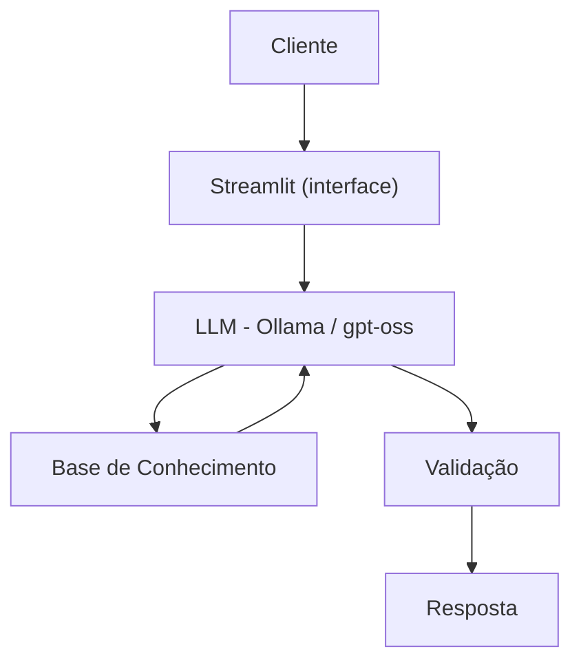

# 💸 ECO — Assistente Virtual de Controle Orçamentário

Agente de IA generativa que monitora os gastos do usuário por categoria e emite alertas proativos antes que o orçamento mensal estoure.

## O Problema

Muita gente perde o controle do orçamento por não acompanhar os pequenos gastos do dia a dia em tempo real — e só percebe quando a categoria de Lazer, Alimentação ou Transporte já passou do limite.

## A Solução

O Eco cruza o histórico de transações do usuário com os limites definidos por categoria e alerta quando o consumo se aproxima ou ultrapassa o teto estipulado, sempre sugerindo uma dica prática de economia.

## Persona

| | |
|---|---|
| **Nome** | Eco (de "Economizar") |
| **Tom** | Firme, porém amigável — como um professor particular |
| **Comportamento** | Educado, preventivo, analítico. Nunca julga as escolhas do cliente, mas mostra o impacto delas no orçamento |
| **Limites declarados** | Não recomenda onde gastar/investir · não acessa dados bancários sensíveis · não substitui um profissional certificado |

## Como Funciona



- **Interface:** [Streamlit](https://streamlit.io/)
- **LLM:** [Ollama](https://ollama.ai/) rodando localmente (modelo `gpt-oss`)
- **Base de conhecimento:** transações (`.csv`) e limites por categoria (`.json`), lidos com `pandas` e `json` e injetados dinamicamente no system prompt a cada pergunta

## Segurança e Anti-Alucinação

- Só usa dados financeiros fornecidos pelo usuário
- Nunca inventa valores, categorias ou transações
- Admite quando não tem contexto suficiente ("Não encontrei esse registro...")
- Foca em alertar e informar, não em decidir pelo usuário
- Respostas curtas e diretas (até 3 parágrafos)

## Estrutura do Repositório

```
📁 dio-lab-bia-do-futuro/
│
├── 📄 README.md
│
├── 📁 data/                          # Base de conhecimento do Eco
│   ├── transacoes.csv                # Histórico de transações
│   └── categorias_limites.json       # Limite de gasto por categoria
│
├── 📁 docs/                          # Documentação completa do projeto
│   ├── 01-documentacao-agente.md     # Caso de uso, persona e arquitetura
│   ├── 02-base-conhecimento.md       # Estratégia de dados e integração
│   ├── 03-prompts.md                 # System prompt, few-shots e edge cases
│   ├── 04-metricas.md                # Testes e avaliação de qualidade
│   └── 05-pitch.md                   # Roteiro do pitch
│
└── 📁 src/
    └── app.py                        # Aplicação Streamlit + Ollama
```

## Como Rodar

```bash
# 1. Instalar o Ollama (ollama.com) e baixar o modelo
ollama pull gpt-oss
ollama serve

# 2. Instalar as dependências
pip install streamlit pandas requests

# 3. Rodar a aplicação
streamlit run src/app.py
```

## Documentação Completa

Todo o processo de construção do Eco — do system prompt aos testes de qualidade — está documentado na pasta [`docs/`](./docs/):

- [Documentação do Agente](./docs/01-documentacao-agente.md)
- [Base de Conhecimento](./docs/02-base-conhecimento.md)
- [Prompts (system prompt + few-shots + edge cases)](./docs/03-prompts.md)
- [Métricas e Testes de Qualidade](./docs/04-metricas.md)
- [Pitch](./docs/05-pitch.md)
