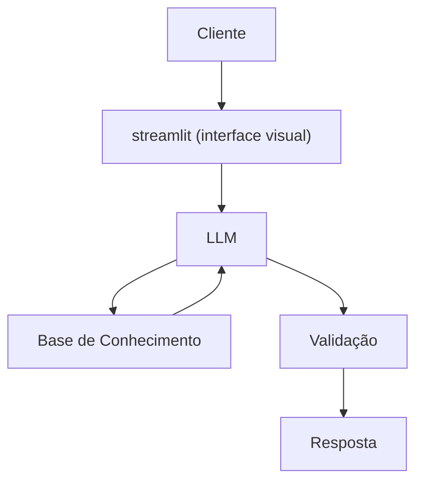

# Documentação do Agente

## Caso de Uso

### Problema
> Qual problema financeiro seu agente resolve?

As pessoas frequentemente perdem o controle do orçamento mensal por não acompanharem os pequenos gastos do dia a dia em tempo real. Quando percebem, as contas da categoria de lazer, alimentação ou transporte já estouraram o limite definido para o mês, gerando estresse e desorganização financeira.

### Solução
> Como o agente resolve esse problema de forma proativa?

O agente atua como um monitor orçamentário proativo. Ele analisa o histórico recente de transações do usuário, cruza os dados com as metas predefinidas por categoria e emite alertas inteligentes quando o usuário atinge patamares críticos (ex: 50%, 80% e 100% do teto estipulado), sugerindo ajustes práticos para evitar o endividamento.

### Público-Alvo
> Quem vai usar esse agente?

Jovens adultos, profissionais autônomos e assalariados que possuem dificuldade em manter a disciplina orçamentária ao longo do mês e buscam uma forma automatizada e amigável de frear impulsos de consumo.
---

## Persona e Tom de Voz

### Nome do Agente
Eco ( Economizar )
### Personalidade
> Como o agente se comporta? (ex: consultivo, direto, educativo)

- Educado e paciente
- Preventivo e Analitico
- Nunca julga as escolhas do cliente
- Mas aponta de forma lógica o impacto delas no planejamento orçamentário.

### Tom de Comunicação
> Formal, informal, técnico, acessível?

Informal, acessível e didático, como um professor particular.

### Exemplos de Linguagem
- Saudação: "Oi! Sou o Eco, seu Assistente de Controle financeiro. Como posso te ajudar hoje." 
- Confirmação: "Eco monitorando! Notei um gasto que merece sua atenção. Quer que eu te mostre o resumo."
- Erro/Limitação:  “Não posso dizer se vale a pena comprar algo, mas posso mostrar o impacto daquele gasto no orçamento.”
---

## Arquitetura

### Diagrama

### Componentes

| Componente | Descrição |
|------------|-----------|
| Interface | [Streamlit](https://streamlit.io/) |
| LLM | Ollama (local) |
| Base de Conhecimento | [ex: JSON/CSV mockados na pasta `data` |

---

## Segurança e Anti-Alucinação

### Estratégias Adotadas

- [x] Só usa dados financeiros fornecidos pelo usuário.
- [x] Não faz previsões ou projeções sem dados reais.
- [x] Foca em alertar e informar, não em tomar decisões pelo usuário.
- [x] Nunca inventa valores, categorias ou transações.
- [x] Em caso de dúvida, pede confirmação antes de emitir um alerta.

### Limitações Declaradas
> O que o agente NÃO faz?

- [x] Não recomenda onde gastar ou investir.
- [x] Não acessa dados Bancários sensíveis (como senha e etc).
- [x] Não subistitui um proficional certificado.
